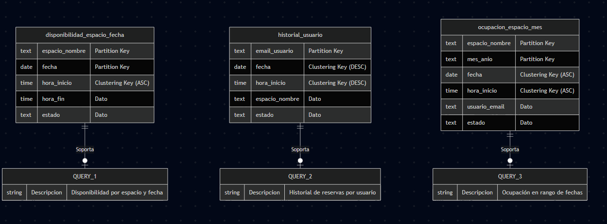

**Curso:** Bases 2

**Universidad:** Universidad de San Carlos de Guatemala (USAC) - FIUSAC 

**Estudiante:** Josue Daniel Solis Osorio

**Carnet:** 202001574

---

# Documentacion Tecnica

## 1. Manual Tecnico

### 1.1 Diseno del Modelo Distribuido (Query-Driven Modeling)

Para este sistema, se adopto una metodologia de diseno basada en consultas (Query-Driven Modeling), distanciandose del modelado relacional tradicional. En Apache Cassandra, las lecturas son mas eficientes cuando los datos se pre-calculan y denormalizan. Por lo tanto, se crearon tablas especializadas para satisfacer cada uno de los patrones de acceso del negocio, evitando por completo el uso de operaciones costosas como `JOINs` y directivas como `ALLOW FILTERING`.

Se identificaron tres consultas principales y se diseno una tabla para cada una:

#### A. Tabla: disponibilidad_espacio_fecha

**Descripción de consulta:** ¿Cuales son las reservas y disponibilidad de un espacio especifico en una fecha exacta?

Esta consulta resuelve la necesidad de ver todas las reservas de un espacio en un día específico, ordenadas cronológicamente por hora. Permite identificar rápidamente qué horas están disponibles para reservar en un espacio determinado.

- Partition Key: `(espacio_nombre, fecha)`
- Justificacion: se eligio una clave de particion compuesta para garantizar que todas las reservas de un mismo espacio en un dia especifico se almacenen en el mismo nodo fisico, permitiendo una lectura instantanea.
- Clustering Key: `hora_inicio (ASC)`
- Efecto: ordena cronologicamente los resultados en disco.

#### B. Tabla: historial_usuario

**Descripción de consulta:** ¿Cual es el historial de reservas de un usuario especifico?

Esta consulta permite visualizar todas las reservas realizadas por un usuario específico, ordenadas de las más recientes a las antiguas. Es fundamental para que los usuarios vean su historial de reservas y para análisis del comportamiento de cada usuario.

- Partition Key: `email_usuario`
- Justificacion: agrupa toda la actividad de un cliente en una sola particion.
- Clustering Key: `fecha DESC, hora_inicio DESC`
- Efecto: retorna primero las reservas mas recientes de forma natural, optimizando el rendimiento.

#### C. Tabla: ocupacion_espacio_mes

**Descripción de consulta:** ¿Cual es la ocupacion de un espacio en un rango de fechas determinado?

Esta consulta permite evaluar la ocupación o disponibilidad de un espacio durante un período específico (por mes). Proporciona informacion para análisis de demanda, predicciones de disponibilidad futura y reportes de utilización de espacios.

- Partition Key: `(espacio_nombre, mes_anio)`
- Justificacion: al incluir el mes y anio (ej. `2026-05`) en la clave de particion, se limita la busqueda de rangos de fechas a una particion manejable (un mes), evitando escanear todo el cluster.
- Clustering Key: `fecha, hora_inicio`
- Efecto: permite aplicar operadores de desigualdad (`>=`, `<=`) sobre la fecha eficientemente.

### 1.2 Configuracion del Cluster

El sistema se implemento sobre un cluster local virtualizado mediante Docker, compuesto por 3 nodos independientes.

- Estrategia de Replicacion: `SimpleStrategy`
- Justificacion: al tratarse de un entorno de un solo Datacenter (`Datacenter1`), esta estrategia es la mas adecuada para distribuir las replicas en el anillo de nodos.

### 1.3 Analisis de Tolerancia a Fallos y Consistency Levels

Se realizaron pruebas de lectura y escritura alterando el nivel de consistencia ante la simulacion de la caida de un nodo (`cassandra-node3`).

En un cluster con $RF = 3$, el quorum se calcula mediante:

$$
Quorum = \left\lfloor \frac{RF}{2} \right\rfloor + 1
$$

Por lo tanto, se requieren 2 nodos activos para alcanzar el quorum.

#### Consistency Level ONE

- Comportamiento: solo requiere confirmacion de 1 nodo replica.
- Impacto ante fallo: el sistema sigue 100% operativo para lecturas y escrituras, con la latencia mas baja.
- Riesgo: se sacrifica consistencia estricta y existe la posibilidad de leer datos obsoletos.

#### Consistency Level QUORUM

- Comportamiento: requiere confirmacion de la mayoria de replicas (2 nodos).
- Impacto ante fallo: con 1 nodo caido (2 activos), la base de datos satisface consultas exitosamente.
- Conclusion: es el balance ideal entre rendimiento y consistencia para este escenario.

#### Consistency Level ALL

- Comportamiento: requiere confirmacion de todos los nodos replica (3 nodos).
- Impacto ante fallo: con un nodo abajo, se produce `UnavailableException`.
- Conclusion: ofrece consistencia maxima, pero reduce significativamente la disponibilidad.

### 1.4 Descripción del Esquema Lógico en Cassandra

Este diagrama ilustra el modelo lógico distribuido diseñado específicamente para Apache Cassandra. Aplicando el principio de Query-Driven Modeling, la arquitectura se alejó del enfoque relacional tradicional; en su lugar, los datos fueron denormalizados y cada tabla se creó para satisfacer exclusivamente una consulta (Query) del negocio. Este diseño especializado garantiza una baja latencia y evita por completo el uso de operaciones costosas como JOINs o directivas ALLOW FILTERING