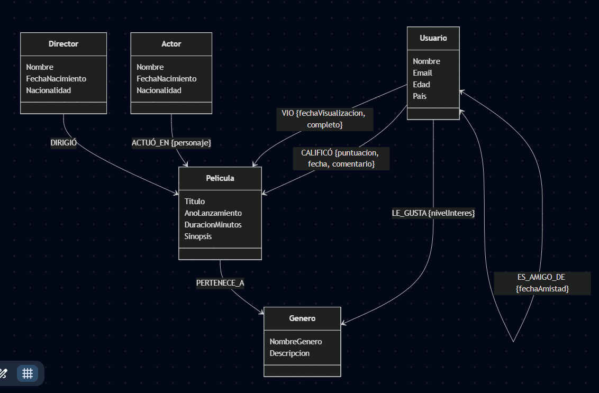
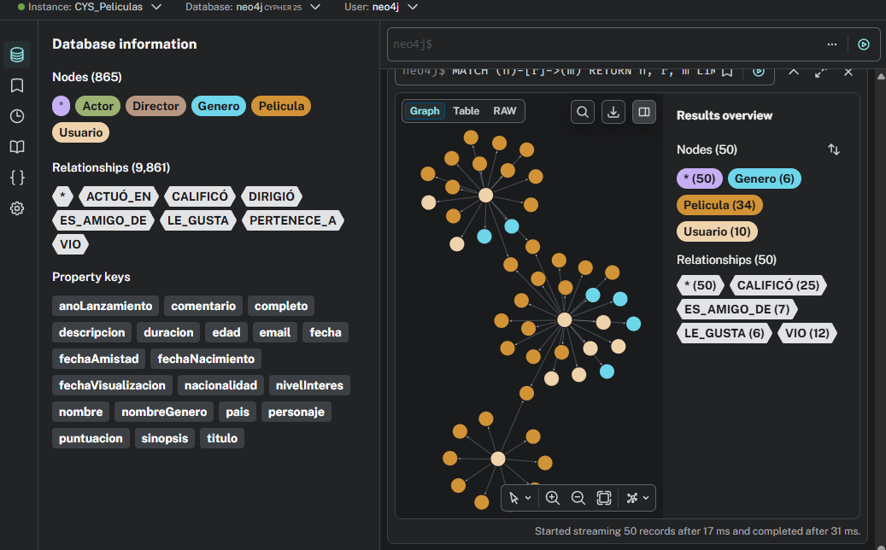
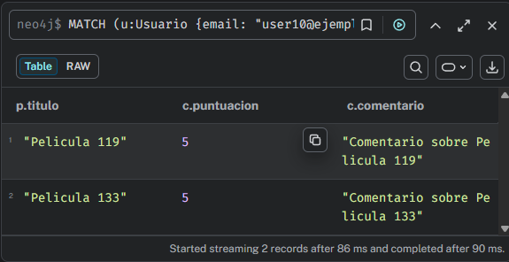
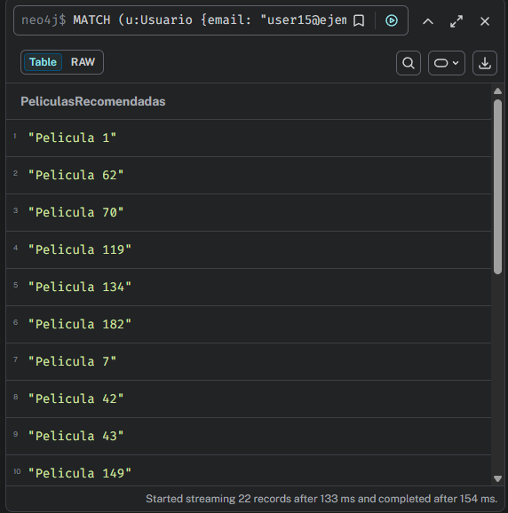
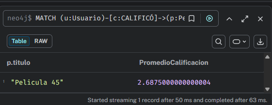
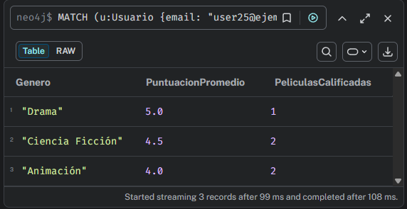
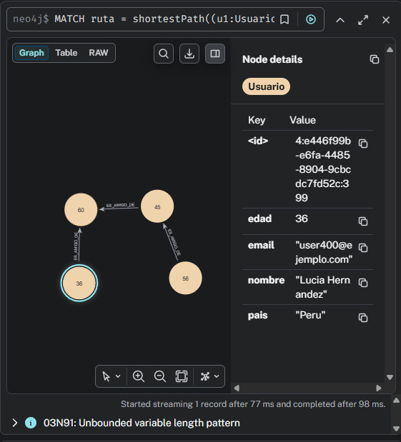
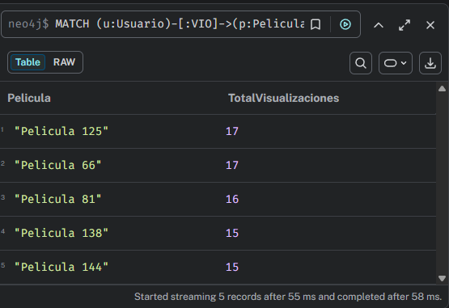
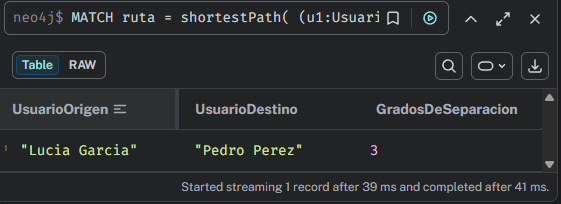
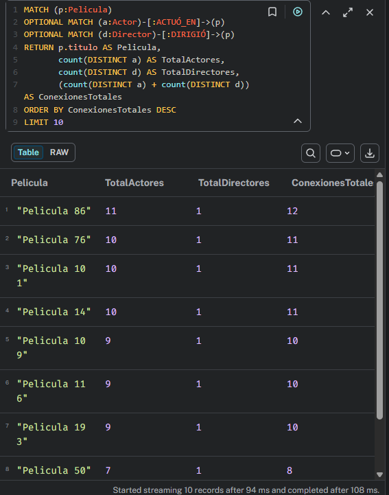

Documentación Técnica: Sistema de Recomendación de Películas con Neo4j
Este documento detalla el diseño e implementación del sistema de recomendación desarrollado para el curso de Sistemas de Bases de Datos 2 de la Universidad de San Carlos de Guatemala.

# 1. Modelo Conceptual de Grafos
El modelo representa las relaciones complejas entre usuarios, contenido cinematográfico y conexiones sociales de forma natural 



# 2. Descripción de Propiedades de Nodos y Relaciones
A continuación se detallan los atributos utilizados para enriquecer el modelo de datos.

2.1 Nodos (Entidades)
| Nodo | Propiedad | Tipo | Ejemplo |
|---|---|---|---|
| Usuario | nombre | STRING | "Juan Perez" |
| Usuario | email (unico) | STRING | "juan.perez@ejemplo.com" |
| Usuario | edad | INTEGER | 28 |
| Usuario | pais | STRING | "Guatemala" |
| Película | titulo | STRING | "Pelicula 45" |
| Película | anioLanzamiento | INTEGER | 2021 |
| Película | duracionMinutos | INTEGER | 118 |
| Película | sinopsis | STRING | "Un grupo de amigos enfrenta un misterio." |
| Género | nombreGenero | STRING | "Ciencia Ficcion" |
| Género | descripcion | STRING | "Historias basadas en avances cientificos." |
| Actor | nombre | STRING | "Ana Lopez" |
| Actor | fechaNacimiento | DATE | "1990-05-14" |
| Actor | nacionalidad | STRING | "Mexicana" |
| Director | nombre | STRING | "Carlos Ruiz" |
| Director | fechaNacimiento | DATE | "1982-11-02" |
| Director | nacionalidad | STRING | "Guatemalteca" |

2.2 Relaciones
| Relación | Propiedad | Tipo | Ejemplo |
|---|---|---|---|
| CALIFICÓ | puntuacion (1-5) | INTEGER | 5 |
| CALIFICÓ | fecha | DATE | "2026-03-10" |
| CALIFICÓ | comentario | STRING | "Excelente historia y actuaciones." |
| VIO | fechaVisualizacion | DATE | "2026-03-12" |
| VIO | completo (true/false) | BOOLEAN | true |
| ES_AMIGO_DE | fechaAmistad | DATE | "2024-08-20" |
| ACTUÓ_EN | nombrePersonaje | STRING | "Detective Morales" |
| LE_GUSTA | nivelInteres (1-5) | INTEGER | 4 |


3. Script Cypher de Creación del Esquema
Se implementaron restricciones de unicidad para garantizar la integridad de los datos antes de la carga masiva 
```Bash
// Restricciones de Unicidad

CREATE CONSTRAINT FOR (u:Usuario) REQUIRE u.email IS UNIQUE;

CREATE CONSTRAINT FOR (p:Pelicula) REQUIRE p.titulo IS UNIQUE;

CREATE CONSTRAINT FOR (g:Genero) REQUIRE g.nombreGenero IS UNIQUE;

CREATE CONSTRAINT FOR (a:Actor) REQUIRE a.nombre IS UNIQUE;

CREATE CONSTRAINT FOR (d:Director) REQUIRE d.nombre IS UNIQUE;
```



4. Documentación de Consultas Implementadas
Se desarrollaron consultas eficientes para responder a los requerimientos de negocio.
Consulta de Películas Recomendadas (Amigos): Encuentra películas vistas por amigos que el usuario aún no ha visto.

## 1. Obtener todas las películas calificadas por un usuario específico con puntuación mayor a 4

**Descripción:** Recupera todas las películas que un usuario ha valorado altamente (puntuación > 4). Incluye el título de la película, la puntuación otorgada y el comentario del usuario. Útil para ver qué películas le han gustado más a un usuario.

```Bash

MATCH (u:Usuario {email: "user10@ejemplo.com"})-[c:CALIFICÓ]->(p:Pelicula)
WHERE c.puntuacion > 4
RETURN p.titulo, c.puntuacion, c.comentario
```



**Análisis :** Esta consulta revela preferencias explícitas del usuario. Si aparecen pocas filas, puede indicar que el usuario califica de forma estricta o que tiene poca actividad, lo cual es útil para ajustar estrategias de recomendación.

## 2. Encontrar las películas que vieron los amigos de un usuario pero que el usuario aún no ha visto

**Descripción:** Implementa un sistema de recomendación social inteligente. Busca todas las películas visualizadas por los amigos del usuario que aún no ha visto. Esta es la consulta fundamental para proporcionar recomendaciones personalizadas basadas en el criterio de la red de amigos.

```Bash

MATCH (u:Usuario {email: "user15@ejemplo.com"})-[:ES_AMIGO_DE]-(amigo:Usuario)
MATCH (amigo)-[:VIO]->(p:Pelicula)
WHERE NOT (u)-[:VIO]->(p)
RETURN DISTINCT p.titulo AS PeliculasRecomendadas
```


**Análisis :** El resultado representa recomendaciones con respaldo social. Cuantos más amigos y visualizaciones compartidas existan, mayor será la diversidad de sugerencias, aunque conviene combinar esta salida con calificaciones para mejorar relevancia.

## 3. Obtener el promedio de calificaciones de una película

**Descripción:** Calcula la calificación promedio que ha recibido una película específica de todos los usuarios que la han visto. Proporciona una métrica general de la calidad percibida y popularidad de una película en la comunidad.

```Bash
MATCH (u:Usuario)-[c:CALIFICÓ]->(p:Pelicula {titulo: "Pelicula 45"})
RETURN p.titulo, avg(c.puntuacion) AS PromedioCalificacion
```


**Análisis :** El promedio resume percepción general de calidad, pero no muestra dispersión. Un promedio alto con pocas calificaciones puede ser menos confiable que uno similar con muchas evaluaciones.

## 4. Encontrar los géneros favoritos de un usuario basándose en sus calificaciones

**Descripción:** Identifica los 3 géneros preferidos de un usuario analizando el promedio de sus calificaciones por género. Incluye cuántas películas de cada género ha calificado. Ayuda a crear un perfil de preferencias de contenido del usuario para recomendaciones más precisas.

```Bash
MATCH (u:Usuario {email: "user25@ejemplo.com"})-[c:CALIFICÓ]->(p:Pelicula)-[:PERTENECE_A]->(g:Genero)
RETURN g.nombreGenero AS Genero, avg(c.puntuacion) AS PuntuacionPromedio, count(p) AS PeliculasCalificadas
ORDER BY PuntuacionPromedio DESC, PeliculasCalificadas DESC
LIMIT 3
```


**Análisis :** Esta consulta construye el perfil de gustos del usuario por género. El conteo de películas calificadas ayuda a distinguir entre preferencia consistente y resultados sesgados por pocas interacciones.

## 5. Encontrar la ruta más corta de amistad entre dos usuarios

**Descripción:** Localiza el camino más corto de amistad que conecta a dos usuarios en la red social. Retorna la secuencia completa de amigos que vinculan a ambos usuarios. Demuestra la potencia de Neo4j en análisis de redes y conexiones entre entidades.

```Bash
MATCH ruta = shortestPath((u1:Usuario {email: "user10@ejemplo.com"})-[:ES_AMIGO_DE*]-(u2:Usuario {email: "user400@ejemplo.com"}))
RETURN ruta
```


**Análisis :** Una ruta corta indica alta cercanía social entre usuarios y potencial de influencia en recomendaciones. Si no existe ruta, los usuarios están desconectados dentro de la red disponible.

## 6. Listar las películas más populares (con más visualizaciones) de un género específico

**Descripción:** Encuentra las 5 películas más vistas dentro de un género específico. Ordena los resultados por cantidad de visualizaciones en orden descendente. Ideal para descubrir qué películas son tendencia dentro de cada categoría.

```Bash
MATCH (u:Usuario)-[:VIO]->(p:Pelicula)-[:PERTENECE_A]->(g:Genero {nombreGenero: "Ciencia Ficción"})
RETURN p.titulo AS Pelicula, count(u) AS TotalVisualizaciones
ORDER BY TotalVisualizaciones DESC
LIMIT 5
```



**Análisis :** Este ranking identifica tendencias por género y puede apoyar decisiones de promoción de contenido. No obstante, mide volumen de vistas, no satisfacción; conviene contrastarlo con calificaciones promedio.

## 7. Calcular rutas más cortas entre usuarios

**Descripción:** Calcula los grados de separación entre dos usuarios (el concepto de "seis grados de separación"). Limita la búsqueda a un máximo de 6 saltos de amistad y retorna la distancia exacta en la red social. Útil para análisis de proximidad entre usuarios.

```Bash
MATCH ruta = shortestPath(
    (u1:Usuario {email: "user1@ejemplo.com"})-[:ES_AMIGO_DE*1..6]-(u2:Usuario {email: "user300@ejemplo.com"})
)
RETURN u1.nombre AS UsuarioOrigen, u2.nombre AS UsuarioDestino, length(ruta) AS GradosDeSeparacion
```



**Análisis :** El valor de grados de separación permite medir proximidad en la comunidad. Distancias menores sugieren mayor probabilidad de compartir preferencias y, por tanto, mejor calidad en recomendaciones basadas en red social.

## 8. Identificar películas altamente conectadas (con más actores y directores reconocidos)

**Descripción:** Identifica las 10 películas con el mayor número de conexiones (actores + directores) en la base de datos. Las películas altamente conectadas típicamente representan grandes producciones con elencos amplios. Proporciona información sobre la magnitud y relevancia de cada película en el sistema.

```Bash
MATCH (p:Pelicula)
OPTIONAL MATCH (a:Actor)-[:ACTUÓ_EN]->(p)
OPTIONAL MATCH (d:Director)-[:DIRIGIÓ]->(p)
RETURN p.titulo AS Pelicula, 
       count(DISTINCT a) AS TotalActores, 
       count(DISTINCT d) AS TotalDirectores, 
       (count(DISTINCT a) + count(DISTINCT d)) AS ConexionesTotales
ORDER BY ConexionesTotales DESC
LIMIT 10
```



**Análisis :** Las películas con más conexiones suelen ser nodos centrales del grafo y candidatas para descubrimiento inicial. Sin embargo, alta conectividad no siempre implica mejor valoración por los usuarios.


4. VENTAJAS DE UTILIZAR NEO4J
-----------------------------------------------------------------------------
* Modelo natural para relaciones: Representa usuarios, películas y amistades de forma directa, facilitando el diseño y la comprensión del sistema.
* Consultas de recomendación eficientes: Las búsquedas por múltiples saltos (amigos, amigos de amigos) se ejecutan de manera más ágil en grafos.
* Flexibilidad del esquema: Permite agregar nuevas relaciones o propiedades sin rediseños complejos de tablas.
* Mejor análisis de redes: Funciones como shortestPath ayudan a medir cercanía entre usuarios para recomendaciones más inteligentes.

5. CONCLUSIONES
-----------------------------------------------------------------------------
* Neo4j permite construir recomendaciones sociales de forma clara y efectiva gracias a su enfoque orientado a relaciones.
* El sistema propuesto demuestra que un modelo de grafos mejora la exploración de conexiones y la interpretación de preferencias de usuarios.

