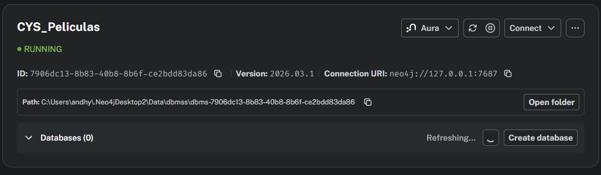
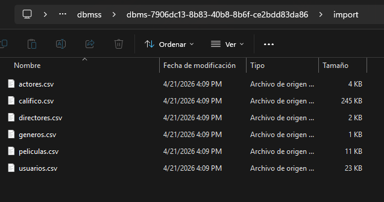

# MANUAL DE USUARIO: SISTEMA DE RECOMENDACIÓN DE PELÍCULAS

Este manual guía al usuario en la instalación, configuración y uso del sistema de recomendaciones basado en Neo4j.

1. INSTALACIÓN Y CONFIGURACIÓN
-----------------------------------------------------------------------------
1. Descargar e instalar Neo4j Desktop (v5.x o superior) desde el sitio oficial.
2. Crear un nuevo proyecto y una base de datos local (DBMS).
3. Establecer una contraseña de al menos 8 caracteres.
4. Iniciar la base de datos haciendo clic en el botón "Start".



2. CARGA MASIVA DE DATOS CON LOAD CSV
-----------------------------------------------------------------------------
Para cargar los datos iniciales, siga estos pasos:
1. Ubique la carpeta de la base de datos y entre a la subcarpeta "import".
2. Copie los archivos CSV (usuarios.csv, peliculas.csv, etc.) dentro de esta carpeta.
3. Abra la herramienta "Query" en Neo4j y ejecute los comandos de carga proporcionados.



3. EJECUCIÓN DE CONSULTAS Y RECOMENDACIONES
-----------------------------------------------------------------------------
Para interactuar con el sistema, utilice la pestaña "Query" e introduzca comandos Cypher.

3.1 Ejemplo Práctico: Recomendación Social
Para ver qué están viendo sus amigos, ejecute la consulta de "Películas vistas por amigos". El sistema devolverá un listado de títulos recomendados.


## 1. Obtener todas las películas calificadas por un usuario específico con puntuación mayor a 4

**Descripción:** Recupera todas las películas que un usuario ha valorado altamente (puntuación > 4). Incluye el título de la película, la puntuación otorgada y el comentario del usuario. Útil para ver qué películas le han gustado más a un usuario.

```Bash

MATCH (u:Usuario {email: "user10@ejemplo.com"})-[c:CALIFICÓ]->(p:Pelicula)
WHERE c.puntuacion > 4
RETURN p.titulo, c.puntuacion, c.comentario
```


## 2. Encontrar las películas que vieron los amigos de un usuario pero que el usuario aún no ha visto

**Descripción:** Implementa un sistema de recomendación social inteligente. Busca todas las películas visualizadas por los amigos del usuario que aún no ha visto. Esta es la consulta fundamental para proporcionar recomendaciones personalizadas basadas en el criterio de la red de amigos.

```Bash

MATCH (u:Usuario {email: "user15@ejemplo.com"})-[:ES_AMIGO_DE]-(amigo:Usuario)
MATCH (amigo)-[:VIO]->(p:Pelicula)
WHERE NOT (u)-[:VIO]->(p)
RETURN DISTINCT p.titulo AS PeliculasRecomendadas
```


## 3. Obtener el promedio de calificaciones de una película

**Descripción:** Calcula la calificación promedio que ha recibido una película específica de todos los usuarios que la han visto. Proporciona una métrica general de la calidad percibida y popularidad de una película en la comunidad.

```Bash
MATCH (u:Usuario)-[c:CALIFICÓ]->(p:Pelicula {titulo: "Pelicula 45"})
RETURN p.titulo, avg(c.puntuacion) AS PromedioCalificacion
```


## 4. Encontrar los géneros favoritos de un usuario basándose en sus calificaciones

**Descripción:** Identifica los 3 géneros preferidos de un usuario analizando el promedio de sus calificaciones por género. Incluye cuántas películas de cada género ha calificado. Ayuda a crear un perfil de preferencias de contenido del usuario para recomendaciones más precisas.

```Bash
MATCH (u:Usuario {email: "user25@ejemplo.com"})-[c:CALIFICÓ]->(p:Pelicula)-[:PERTENECE_A]->(g:Genero)
RETURN g.nombreGenero AS Genero, avg(c.puntuacion) AS PuntuacionPromedio, count(p) AS PeliculasCalificadas
ORDER BY PuntuacionPromedio DESC, PeliculasCalificadas DESC
LIMIT 3
```


## 5. Encontrar la ruta más corta de amistad entre dos usuarios

**Descripción:** Localiza el camino más corto de amistad que conecta a dos usuarios en la red social. Retorna la secuencia completa de amigos que vinculan a ambos usuarios. Demuestra la potencia de Neo4j en análisis de redes y conexiones entre entidades.

```Bash
MATCH ruta = shortestPath((u1:Usuario {email: "user10@ejemplo.com"})-[:ES_AMIGO_DE*]-(u2:Usuario {email: "user400@ejemplo.com"}))
RETURN ruta
```


## 6. Listar las películas más populares (con más visualizaciones) de un género específico

**Descripción:** Encuentra las 5 películas más vistas dentro de un género específico. Ordena los resultados por cantidad de visualizaciones en orden descendente. Ideal para descubrir qué películas son tendencia dentro de cada categoría.

```Bash
MATCH (u:Usuario)-[:VIO]->(p:Pelicula)-[:PERTENECE_A]->(g:Genero {nombreGenero: "Ciencia Ficción"})
RETURN p.titulo AS Pelicula, count(u) AS TotalVisualizaciones
ORDER BY TotalVisualizaciones DESC
LIMIT 5
```


## 7. Calcular rutas más cortas entre usuarios

**Descripción:** Calcula los grados de separación entre dos usuarios (el concepto de "seis grados de separación"). Limita la búsqueda a un máximo de 6 saltos de amistad y retorna la distancia exacta en la red social. Útil para análisis de proximidad entre usuarios.

```Bash
MATCH ruta = shortestPath(
    (u1:Usuario {email: "user1@ejemplo.com"})-[:ES_AMIGO_DE*1..6]-(u2:Usuario {email: "user300@ejemplo.com"})
)
RETURN u1.nombre AS UsuarioOrigen, u2.nombre AS UsuarioDestino, length(ruta) AS GradosDeSeparacion
```


## 8. Identificar películas altamente conectadas (con más actores y directores reconocidos)

**Descripción:** Identifica las 10 películas con el mayor número de conexiones (actores + directores) en la base de datos. Las películas altamente conectadas típicamente representan grandes producciones con elencos amplios. Proporciona información sobre la magnitud y relevancia de cada película en el sistema.

```Bash
MATCH (p:Pelicula)
OPTIONAL MATCH (a:Actor)-[:ACTUÓ_EN]->(p)
OPTIONAL MATCH (d:Director)-[:DIRIGIÓ]->(p)
RETURN p.titulo AS Pelicula, 
       count(DISTINCT a) AS TotalActores, 
       count(DISTINCT d) AS TotalDirectores, 
       (count(DISTINCT a) + count(DISTINCT d)) AS ConexionesTotales
ORDER BY ConexionesTotales DESC
LIMIT 10
```


4. INTERPRETACIÓN DE RESULTADOS
-----------------------------------------------------------------------------
En todas las consultas, los primeros resultados suelen representar mayor relevancia según el criterio aplicado (mejor calificación, mayor número de visualizaciones, mayor cercanía social o mayor conectividad). Para una lectura correcta, considere siempre el contexto del usuario analizado, la cantidad de datos disponibles y el tipo de métrica devuelta por cada consulta.


5. RESOLUCIÓN DE PROBLEMAS COMUNES
-----------------------------------------------------------------------------
* Error 22N43 (Unable to load external resource):
  Solución: Verifique que los archivos CSV estén dentro de la carpeta "import".

* Advertencia: Cartesian Product Warning:
  Solución: Asegúrese de conectar los nodos en el MATCH o usar WHERE.

* Advertencia: Unbounded Pattern Warning:
  Solución: Use un límite de saltos (ej. [*1..6]) en rutas largas.
